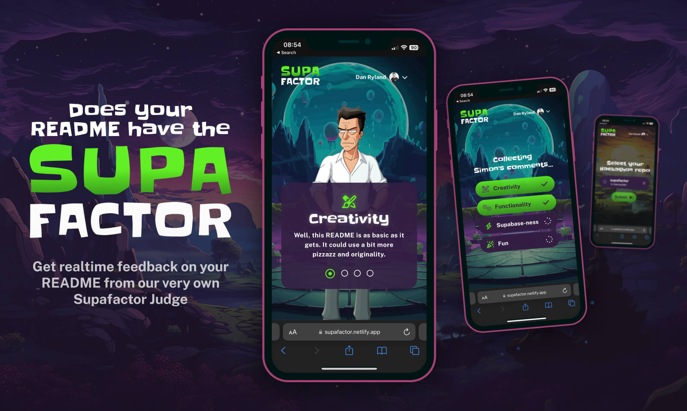

# Supafactor: Does your README have it?

## A Rick-and-Morty-Xfactor-inspired experience


[PLAY: Try Supafactor for yourself](https://supafactor.netlify.app/)

WATCH: Watch a demo (Coming soon)



Hi there, I’m Dan Ryland ([@RealDanRyland](https://twitter.com/realdanryland)). Perhaps you recall my previous hackathon endeavour, [Groove AI](https://github.com/danryland/groove-ai)? Well, buckle up because I'm back for round two!

If you're anything like me - a creative soul who's endlessly entertained by the ingenious world of Rick and Morty - you'll appreciate the depths of imagination that show dives into. It's the fantastic characters, intriguing worlds, and gripping storylines that always leave me awestruck.

Taking a page from Rick and Morty's vibrant visual style and combining it with the thrill of talent shows, I introduce to you: Supafactor - a groundbreaking way to judge hackathon entries.

Through four criteria: creativity, functionality, Supabase-ness and fun, our Supafactor judge will give realtime feedback on the README of your hackathon entry.

Based on Simon’s feedback - yes, we have our very own, Rick-and-Morty-inspired, Simon Cowell - you’ll then find out if you get to claim the coveted status of having the Supafactor.

Does your README have the Supafactor? [Let’s find out](https://supafactor.netlify.app/)

## How does it work?

Simply log in via Github, and Supafactor will display eligible repositories created during Hackathon 8. Choose one, and watch as your README is scrutinised against our criteria using Open AI's GPT 3.5 Turbo. Anticipate feedback with a blend of cheeky wit and sass. Concluding with a score, see if your README boasts the Supafactor charm. And yes, bragging rights come with badges for those who make the cut!

Ready to test your README? [Let's discover if you've got the Supafactor](https://supafactor.netlify.app/)

## Supabase features

The following Supabase features are being used:

- Auth
  - Through OAuth (Github)
- Database
  - Fetch
  - Upsert
- Edge function
  - Open AI (GPT 3.5 Turbo)

## Design process

- [Figma](https://www.figma.com/) for prototyping and designing assets
- [Midjourney](https://www.midjourney.com/) for Rick-and-Morty inspired backgrounds and assets
- [Vectorizer](https://vectorizer.ai/) for converting Midjourney assets to SVGs

## Build process

Built entierly using [Quasar framework](https://quasar.dev/)

To run locally, you'll need the following:

### Environment variables

```bash
SITE_URL
SUPABASE_URL
SUPABASE_KEY
SUPABASE_FUNCTION
```

For the edge function:

```bash
OPEN_API_KEY
```

### Install the dependencies

```bash
yarn
# or
npm install
```

#### Start the app in development mode (hot-code reloading, error reporting, etc.)

```bash
quasar dev
```

### Deploy

Deploy the Supabase edge function:

```bash
supabase functions deploy review
```

Hosted on [Netlify](https://www.netlify.com/)

Build the app for production

```bash
quasar build
```

Publish directory:

```bash
dist/spa
```
